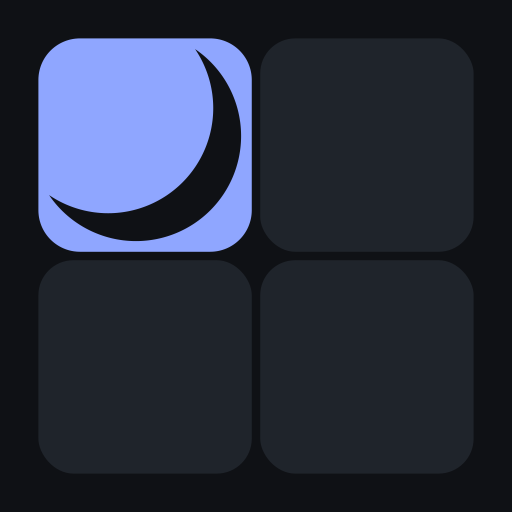

  

<h1 align="center">Luma — Ambient Display</h1>

A modular ambient display designed for desktop environments.

  
  
  
  
  

---

# Luma — Ambient Display
Luma is a modular ambient display designed for desktop environments.

It turns your screen into a calm, living surface. Something that sits quietly in the background while offering subtle, useful information when you need it.

Luma is not a traditional screensaver, and it is not a heavy dashboard either.
The most accurate way to describe it is as an **Ambient Display**: a minimal, elegant layer that blends photos, gentle motion, and modular widgets into a single, distraction-free experience.

# What Luma aims to offer
- Smooth rotation of photos and GIFs

- Soft transitions and shader-based visual effects

- A minimal clock and optional information widgets.

- A modular dashboard system

- Lightweight performance and clean architecture

- No ads, no tracking, no telemetry

- Fully open source (MIT)

# Why Godot?

This project is built using Godot Engine (https://github.com/godotengine/godot).
Yes, it’s primarily a game engine, even though it also provides solid tools for building applications.

When I started Luma, I didn’t have much experience working directly with low-level graphics libraries. Instead of fighting the tooling, I chose something that would let me focus on design, structure, and experimentation without getting stuck on rendering details.

I chose Godot because:

1. I genuinely enjoy using it
2. I’m already comfortable with it
3. It’s lightweight and fully open source

In the future, I may explore rewriting parts of this project in Python or Java. But at this stage, Godot felt like the most practical and honest choice; something that allows me to build confidently without sacrificing performance or flexibility.

# Contributing

Pull requests are very welcome.

If you’d like to improve the structure, refactor code, optimize performance, or fix conceptual mistakes, please feel free. I’m aware that I’ll likely make architectural or technical errors along the way, and thoughtful improvements are always appreciated.

You’re also welcome to add features or experiment with new ideas.

If possible, please explain your changes clearly in the pull request description. Open communication helps keep the project coherent as it grows.
